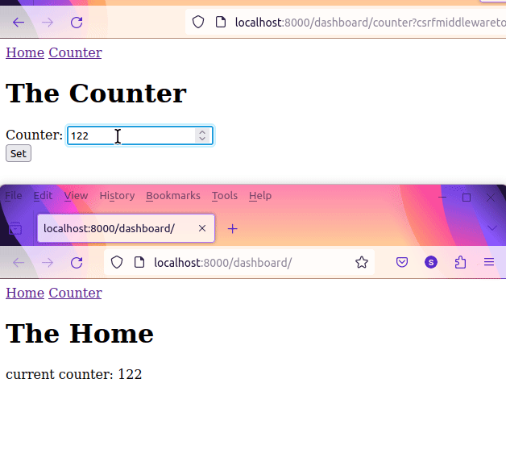

Demo on WSGI django page subscripe to websocket in different process.

It uses redis as pubSub broker to send data between process



# How to DEMO
run the main django app
```
python manage runserver 8000
```

Run the websocket publisher as another process
```
python ws/counter.py
```